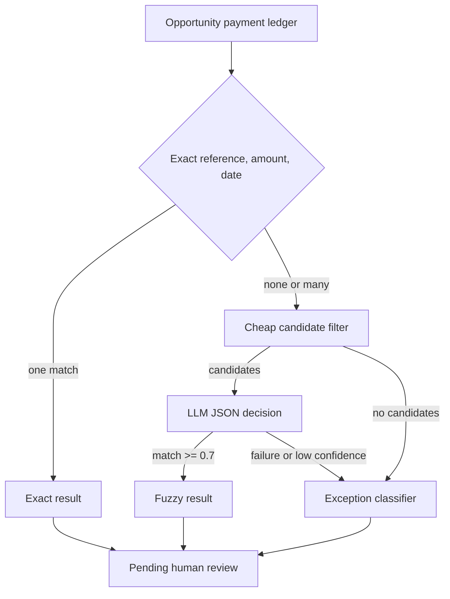

# LedgerMatch

LedgerMatch compares the read-only payment ledger derived from CampusX opportunities with synthetic settlement records. It uses deterministic matching first, asks an LLM only for ambiguous candidates, and stores every outcome as `pending_review`.

## API

All paths are under `/api/reconciliation`.

- `POST /generate-data` (admin, development only)
- `POST /run` (admin)
- `GET /results` (authenticated; supports `tier`, `exceptionType`, and `status`)
- `GET /metrics` (authenticated)
- `PATCH /:id/approve` and `PATCH /:id/reject` (authenticated)

Set `OPENAI_API_KEY` to enable fuzzy resolution. `OPENAI_API_URL` and `OPENAI_MODEL` are optional. Set `SIMULATE_LLM_FAILURE=true` to demonstrate graceful fallback.

## Cascade

The reconciliation module never writes to `Opportunity` or any payment collection. Approval changes only the reconciliation result status.

## Demo flow

1. Start MongoDB and the backend.
2. Sign in as an admin.
3. `POST /api/reconciliation/generate-data` with an optional JSON body such as `{ "limit": 200 }`.
4. `POST /api/reconciliation/run`.
5. Open `/reconciliation` in the client.

The generator stores planted categories in settlement `rawMeta`, so metrics can be audited instead of inferred from the displayed results.
